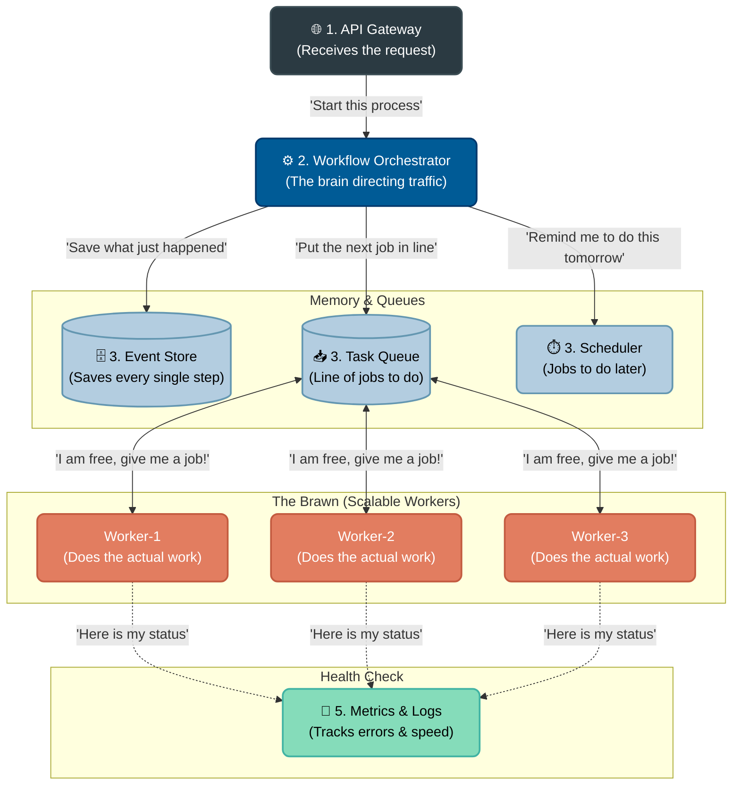

<div align="center">
  
  # ⏳ Chronos
  
  **A simplified distributed workflow engine built in Go to understand Temporal.**
  
  [](https://goreportcard.com/report/github.com/markasaicharan/chronos)
  [](https://opensource.org/licenses/MIT)
  <br/>
  
  
  
  

</div>

---

## 🤔 Why I Built This
- **The Motivation:** I wanted to demystify how massive infrastructure companies (like Temporal) achieve "Durable Execution" under the hood.
- **The Problem:** In a standard microservice, if a server crashes halfway through a multi-step task, data is left in an inconsistent state.
- **The Solution:** I built Chronos from scratch to master handling failures, persisting workflow progress, and automatically resuming state.

---

## 🏗️ Architecture



### 🔄 Execution Flow
1. **Gateway:** Receives API request to begin a workflow.
2. **Orchestrator:** Pushes the first task into the Redis Queue.
3. **Workers:** Distributed nodes poll Redis, lock the task, and execute it.
4. **Event Store:** Results are appended to PostgreSQL as immutable events.

---

## 🧩 Core Technical Concepts

- 📜 **Event Sourcing:** State is reconstructed dynamically by replaying a history of immutable events (e.g., `["started", "payment-ok", "inventory-failed"]`), rather than updating a single `status` column.
- ⏪ **Workflow Replay:** If a worker node crashes mid-execution, a new node rebuilds the exact memory state by replaying the event history.
- 🌐 **Distributed Workers:** Execution nodes are completely decoupled from the orchestrator. Scale horizontally by simply adding more workers.
- 💀 **Dead Letter Queues (DLQ):** Failed tasks utilize exponential backoff retries. If max attempts are reached, tasks are pushed to a DLQ for manual intervention.

---

## 🛠️ Features Implemented (v1.0 MVP)

- **Activity Registry:** Business logic is entirely decoupled from the engine. Define any Go function, use `RegisterActivity` to attach it to the worker, and the engine dynamically routes and executes it.
- **Dead Letter Queue (DLQ) & Retry Engine:** Built-in fault tolerance. If an activity fails (e.g. simulated network timeout), the worker catches it, increments a retry counter, and re-queues it. After 3 consecutive failures, the task is safely quarantined in a Redis DLQ (`chronos:tasks:dlq`).
- **The "Time Machine" API:** Because state is Event Sourced, you can hit `GET /workflow/history?id=<ID>` to receive a perfectly chronological, immutable audit log of every state change that ever happened to that workflow.

---

## 💻 Running It Locally

You can run this entire distributed architecture locally with Docker:

**1. Start Infrastructure (Postgres & Redis):**
```bash
docker compose up -d
```

**2. Start the Orchestrator API (Terminal 1):**
```bash
make run-server
```

**3. Start a Scalable Worker Node (Terminal 2):**
```bash
make run-worker
```

**4. Trigger a Workflow (Terminal 3):**
```bash
curl -X POST http://localhost:8080/workflow/start
```

**5. View the Immutable Audit Log:**
```bash
# Replace <ID> with the workflow_id returned from step 4
curl "http://localhost:8080/workflow/history?id=<ID>"
```

---

## 🚀 What I Can Build Now
Working on this project gave me hands-on experience to build:
- **Fault-Tolerant Microservices:** Systems that gracefully survive network outages and node crashes.
- **Event-Driven Platforms:** Architectures that use Event Sourcing for perfect audit logs and state recovery.
- **Scalable Worker Clusters:** High-throughput, distributed background processing using Redis.
- **Observable Distributed Systems:** Deeply instrumented systems using OpenTelemetry and Prometheus.

---

